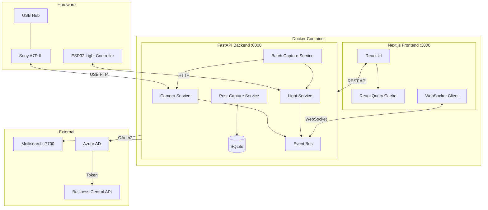
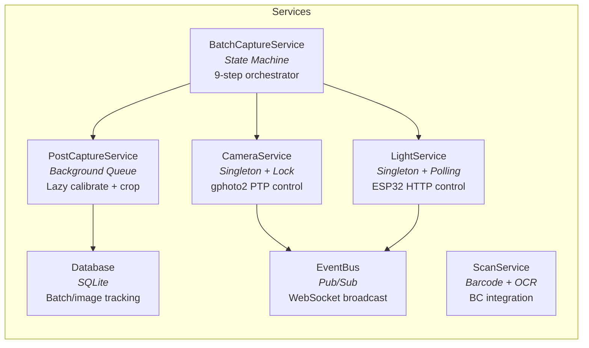
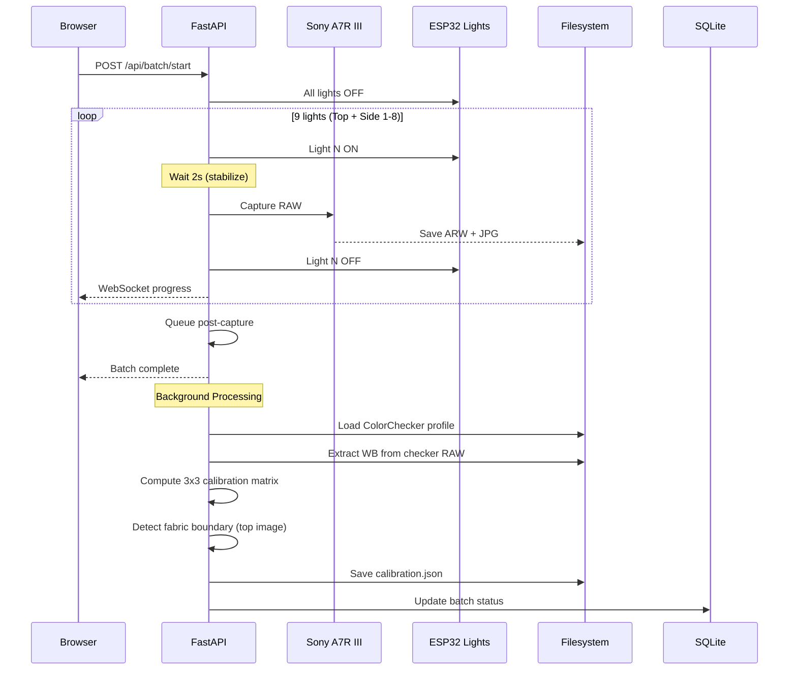
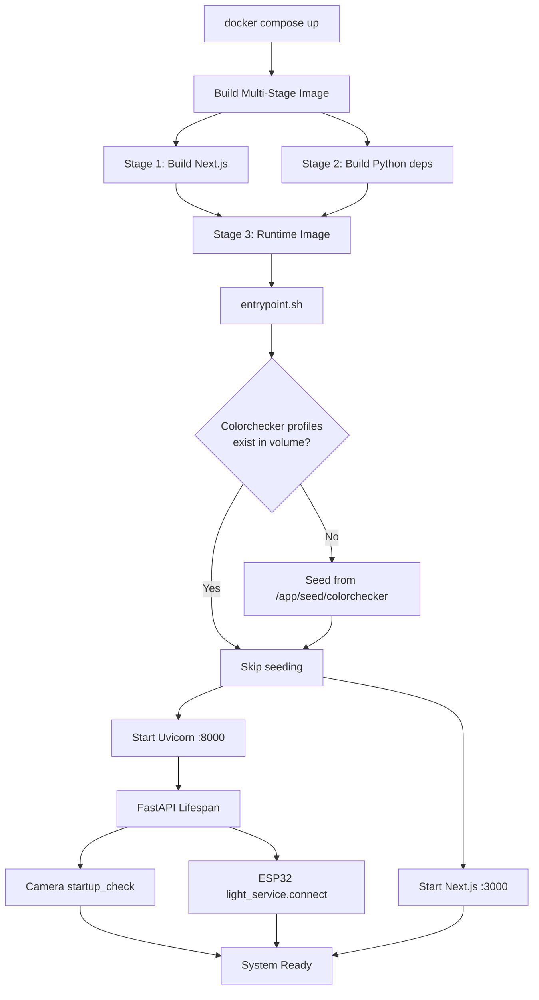
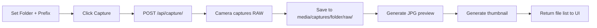
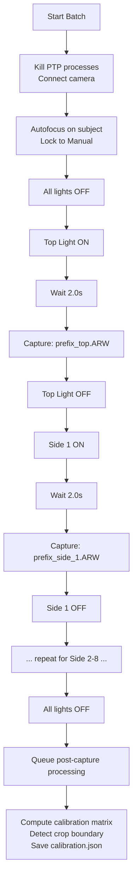
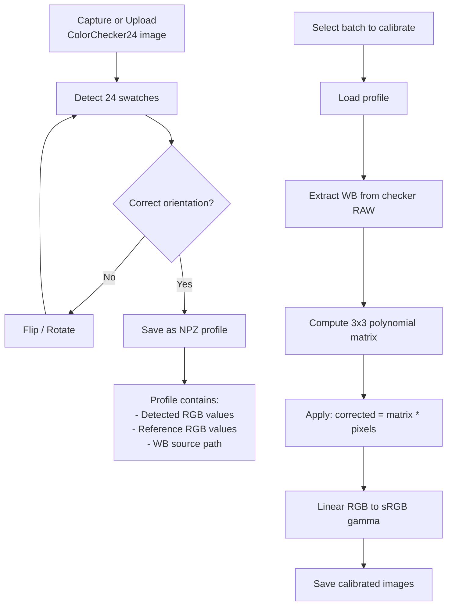
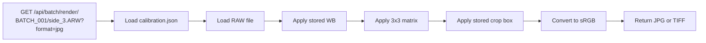
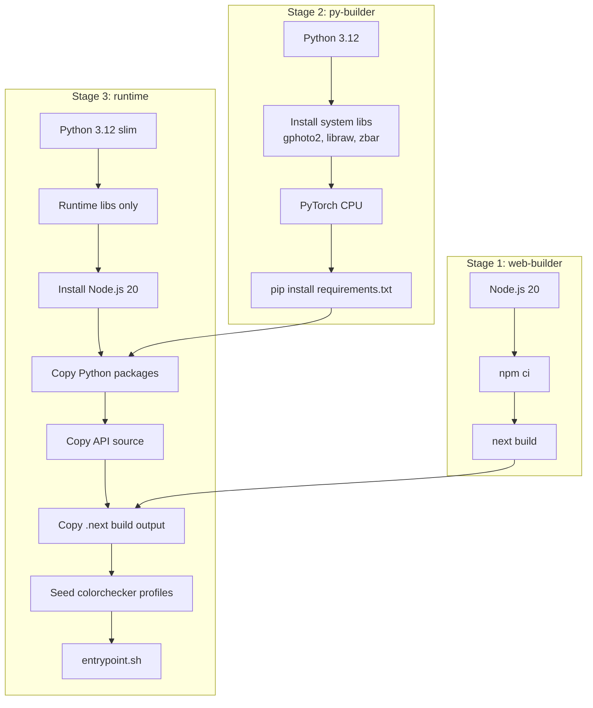
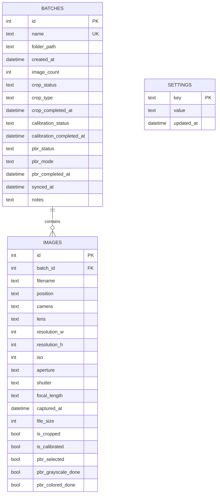

# Camera Control System

> Professional-grade automated photography rig for Sony A7R III with multi-light capture, color calibration, and PBR map generation.

---

## Table of Contents

- [Overview](#overview)
- [System Architecture](#system-architecture)
- [Hardware Setup](#hardware-setup)
- [Tech Stack](#tech-stack)
- [Getting Started](#getting-started)
- [Application Pages](#application-pages)
- [Capture Workflow](#capture-workflow)
- [Processing Pipeline](#processing-pipeline)
- [API Reference](#api-reference)
- [WebSocket Events](#websocket-events)
- [Configuration](#configuration)
- [Deployment](#deployment)
- [Troubleshooting](#troubleshooting)

---

## Overview

The Camera Control System is a full-stack application that automates high-precision product photography. It controls a Sony A7R III camera and a 9-light ESP32 rig to capture multi-directional images, then processes them through color calibration and photometric stereo to produce publication-ready images and PBR (Physically Based Rendering) texture maps.

```
 +-----------+     USB/PTP      +------------------+     HTTP     +------------------+
 | Sony      | <--------------> |   FastAPI         | <---------> |   Next.js        |
 | A7R III   |                  |   Backend :8000   |             |   Frontend :3000 |
 +-----------+                  +------------------+             +------------------+
                                       ^    ^                           |
                                       |    |                           |
                                HTTP   |    |  WebSocket                | WebSocket
                                       |    |                           |
                                +------+    +------+                    |
                                |                  |                    |
                          +-----------+     +-------------+      +-------------+
                          |  ESP32    |     | Meilisearch |      |  Browser    |
                          |  Lights   |     |  :7700      |      |  Client     |
                          +-----------+     +-------------+      +-------------+
```

### Key Capabilities

- **Camera Control** -- Full remote control of Sony A7R III (settings, focus, live view, capture)
- **9-Light Batch Capture** -- Automated sequential capture under Top + 8 Side lights
- **Color Calibration** -- ColorChecker24-based polynomial color correction
- **Auto Crop** -- SAM-powered fabric boundary detection and cropping
- **PBR Generation** -- Photometric stereo from multi-light images (albedo, normals, roughness, height)
- **Barcode/OCR Scanning** -- Identify fabrics via barcode or OCR with fuzzy name matching
- **Business Central Sync** -- Pull fabric catalog from Microsoft Dynamics 365

---

## System Architecture

### High-Level Architecture



### Service Layer



### Data Flow -- Batch Capture



---

## Hardware Setup

### Physical Rig

```
                    +-----------+
                    | Top Light |  (GPIO 26)
                    +-----+-----+
                          |
        +---------+-------+-------+---------+
        |         |               |         |
   Side 8    Side 1    [Camera]    Side 5    Side 4
  (GPIO 27) (GPIO 25)   Sony     (GPIO 4)  (GPIO 21)
        |         |    A7R III    |         |
   Side 7    Side 2               Side 6    Side 3
  (GPIO 12) (GPIO 5)             (GPIO 13) (GPIO 19)
        |         |               |         |
        +---------+-------+-------+---------+
```

| Component | Details |
|-----------|---------|
| **Camera** | Sony A7R III (61MP, ARW RAW) |
| **Connection** | USB PTP via gphoto2 |
| **Lights** | 9x LED panels (1 Top + 8 Side) |
| **Controller** | ESP32 microcontroller, HTTP API |
| **GPIO Pins** | Top: 26, Sides: 25, 5, 19, 21, 4, 13, 12, 27 |

### Light Positions

| ID | Name | GPIO Pin | Position |
|----|------|----------|----------|
| 0 | Top Light | 26 | Directly above subject |
| 1 | Side 1 Light | 25 | Front-left |
| 2 | Side 2 Light | 5 | Left |
| 3 | Side 3 Light | 19 | Back-left |
| 4 | Side 4 Light | 21 | Back |
| 5 | Side 5 Light | 4 | Back-right |
| 6 | Side 6 Light | 13 | Right |
| 7 | Side 7 Light | 12 | Front-right |
| 8 | Side 8 Light | 27 | Front |

---

## Tech Stack

### Backend (Python 3.12)

| Category | Libraries |
|----------|-----------|
| **Framework** | FastAPI, Uvicorn, Pydantic v2 |
| **Camera** | gphoto2 (USB PTP control) |
| **Image Processing** | rawpy, Pillow, OpenCV, tifffile |
| **Color Science** | colour-science, colour-checker-detection |
| **ML / Segmentation** | PyTorch (CPU), Segment Anything (MobileSAM) |
| **Scanning** | pyzbar, pytesseract, cleanco |
| **Search** | Meilisearch client |
| **Async** | aiohttp, websockets |
| **Database** | SQLite (built-in) |

### Frontend (Next.js 14)

| Category | Libraries |
|----------|-----------|
| **Framework** | Next.js 14 (App Router), React 18 |
| **Language** | TypeScript 5 (strict mode) |
| **Styling** | Tailwind CSS v4, custom teal palette |
| **State** | TanStack React Query v5 |
| **HTTP** | Axios |
| **Icons** | Lucide React |
| **Real-time** | Native WebSocket API |

### Infrastructure

| Component | Technology |
|-----------|-----------|
| **Container** | Docker (multi-stage build) |
| **Orchestration** | Docker Compose |
| **Search Engine** | Meilisearch v1.6 |
| **ERP** | Microsoft Dynamics 365 Business Central |
| **Auth** | Azure AD OAuth2 |

---

## Getting Started

### Prerequisites

- Docker & Docker Compose
- Sony A7R III connected via USB
- ESP32 light controller on local network (default: `192.168.0.44`)

### Quick Start

```bash
# Clone the repository
git clone https://github.com/Silktex/camera_system.git
cd camera_system

# Configure environment
cp .env.example .env
# Edit .env with your Azure/BC credentials

# Build and start
docker compose up --build
```

| Service | URL |
|---------|-----|
| **Web UI** | http://localhost:3000 |
| **API Docs** | http://localhost:8000/docs |
| **Meilisearch** | http://localhost:7700 |

### Startup Sequence



### Development (No Docker)

```bash
# API
cd api
python -m venv .venv && source .venv/bin/activate
pip install -r requirements.txt
uvicorn main:app --reload --port 8000

# Web (separate terminal)
cd web
npm install
npm run dev
```

---

## Application Pages

### Home -- Camera Control (`/`)

The main workspace with a 2-column layout: sidebar controls on the left, live view on the right.

```
+----------------------------------+-------------------------------+
|  Dashboard Header                |  Camera Model  | Connect     |
|  [All] [Batch] [Gallery] [Lights] [Processing]                  |
+----------------------------------+-------------------------------+
|  Tab: [Single] [Color] [Batch]  |                               |
|                                  |                               |
|  +----------------------------+ |  +---------------------------+ |
|  | Capture Form               | |  | Live View Panel           | |
|  | Folder: [___________]      | |  |                           | |
|  | Prefix: [___________]      | |  |   MJPEG Stream            | |
|  | Count:  [1]                | |  |   from /api/liveview      | |
|  |                            | |  |                           | |
|  | [  Capture  ]              | |  |   [Start] [Stop] [Focus]  | |
|  +----------------------------+ |  +---------------------------+ |
|                                  |                               |
|  +----------------------------+ |  +---------------------------+ |
|  | Light Control Panel        | |  | Camera Settings           | |
|  | [All On] [All Off]         | |  | Exposure | Focus | WB     | |
|  |  Top ........ [toggle]     | |  | ISO: [Auto]               | |
|  |  Side 1 ..... [toggle]     | |  | Aperture: [f/8]           | |
|  |  Side 2 ..... [toggle]     | |  | Shutter: [1/125]          | |
|  |  ...                       | |  | ...                       | |
|  +----------------------------+ |  +---------------------------+ |
+----------------------------------+-------------------------------+
```

**Keyboard Shortcuts:**

| Key | Action |
|-----|--------|
| `Space` | Toggle all lights on/off |
| `t` | Toggle top light |
| `1`-`8` | Toggle side lights |
| `s` / `c` / `b` | Switch tabs (Single / Color / Batch) |
| `f` | Focus folder input |
| `l` | Toggle live view |
| `p` | Go to Processing |
| `g` | Go to Gallery |
| `d` | Go to Dashboard |

### Batch Capture (`/batch`)

Automated 9-light capture sequence with real-time progress tracking.

```
+-------------------------------------------------------------------+
|  Batch Capture Configuration                                       |
|  Folder: [____________]  Prefix: [____________]                    |
|  Profile: [CHECKER-17FEB ▼]   Delay: [2.0s]                       |
|  [Scan Barcode]  [Start Batch]                                     |
+-------------------------------------------------------------------+
|  Progress: Step 3/9 -- Capturing Side 2                            |
|  +---------+---------+---------+---------+---------+               |
|  |   Top   | Side 1  | Side 2  | Side 3  |  ...    |              |
|  |   done  |  done   | active  | waiting | waiting |              |
|  +---------+---------+---------+---------+---------+               |
|                                                                     |
|  Captured Images:                                                   |
|  +-------+ +-------+ +-------+ +-------+                           |
|  | top   | | side1 | | side2 | |       |                           |
|  +-------+ +-------+ +-------+ +-------+                           |
+-------------------------------------------------------------------+
```

### Gallery (`/gallery`)

Browse, view, zoom, and manage captured images.

```
+-------------------------------------------------------------------+
|  Gallery > captures > BATCH_001                                     |
+-------------------------------------------------------------------+
|  +----------+  +----------+  +----------+  +----------+            |
|  | raw/     |  | jpg/     |  | tiff/    |  | cropped/ |            |
|  | 9 files  |  | 9 files  |  | 9 files  |  | 9 files  |           |
|  +----------+  +----------+  +----------+  +----------+            |
|                                                                     |
|  Files in jpg/:                                                     |
|  +--------+ +--------+ +--------+ +--------+ +--------+ +--------+ |
|  |  top   | | side1  | | side2  | | side3  | | side4  | | side5  | |
|  +--------+ +--------+ +--------+ +--------+ +--------+ +--------+ |
|                                                                     |
|  [Click image for full-screen viewer with zoom/pan/navigate]        |
+-------------------------------------------------------------------+
```

### Lights (`/lights`)

Direct ESP32 light control with brightness sliders.

```
+-------------------------------------------------------------------+
|  ESP32 Light Controller        [Refresh] [Reconnect]               |
|  Status: Connected (192.168.0.44)                                  |
|  [ALL ON]  [ALL OFF]   Master: [======|====] 75%                   |
+-------------------------------------------------------------------+
|  +------------------+ +------------------+ +------------------+     |
|  | Top Light        | | Side 1 Light     | | Side 2 Light     |    |
|  | GPIO 26          | | GPIO 25          | | GPIO 5           |    |
|  | [ON/OFF toggle]  | | [ON/OFF toggle]  | | [ON/OFF toggle]  |    |
|  | [=====|=====]80% | | [=====|=====]80% | | [=====|=====]80% |    |
|  +------------------+ +------------------+ +------------------+     |
|  ...                                                                |
+-------------------------------------------------------------------+
```

### Processing (`/processing`)

Three-phase processing pipeline with batch management.

```
+-------------------------------------------------------------------+
|  Processing Pipeline                                                |
|  +----------------+ +------------------+ +----------------+         |
|  | CROP           | | CALIBRATION      | | PBR            |        |
|  | 12 pending     | | 8 pending        | | 15 pending     |        |
|  | 3 in_progress  | | 2 in_progress    | | 0 in_progress  |        |
|  | 20 completed   | | 25 completed     | | 20 completed   |        |
|  +----------------+ +------------------+ +----------------+         |
+-------------------------------------------------------------------+
|  Batch List                                   [Sync All]            |
|  Name          | Images | Crop  | Calibration | PBR    | Actions   |
|  BATCH_001     |   9    | done  |    done     | pending| [Process] |
|  BATCH_002     |   9    | done  |   pending   |   --   | [Process] |
|  BATCH_003     |   9    | pending|    --      |   --   | [Process] |
+-------------------------------------------------------------------+
```

---

## Capture Workflow

### Single Capture



### Batch Capture (9-Light Sequence)



### ColorChecker Calibration



---

## Processing Pipeline

### Three-Phase Pipeline

```mermaid
graph LR
    subgraph Phase 1 -- CROP
        RAW[RAW Images] --> TIFF[Convert to 16-bit TIFF]
        TIFF --> DETECT[Auto-detect boundary<br/>SAM / MobileSAM]
        DETECT --> CROP[Crop all 9 images]
    end

    subgraph Phase 2 -- CALIBRATION
        CROP --> PROFILE[Load ColorChecker profile]
        PROFILE --> MATRIX[Compute correction matrix]
        MATRIX --> APPLY[Apply to all images]
    end

    subgraph Phase 3 -- PBR
        APPLY --> STEREO[Photometric Stereo]
        STEREO --> ALBEDO[Albedo Map]
        STEREO --> NORMAL[Normal Map]
        STEREO --> ROUGH[Roughness Map]
        STEREO --> HEIGHT[Height Map]
    end
```

### Folder Structure Per Batch

```
media/captures/BATCH_001/
  raw/                    # Original ARW files from camera
    BATCH_001_top.ARW
    BATCH_001_side_1.ARW
    ...
    BATCH_001_side_8.ARW
  jpg/                    # JPEG previews
  thumbnail/              # Small thumbnails for gallery
  tiff/                   # 16-bit linear TIFF conversions
  cropped/                # Post-crop images
  cropped_thumbnail/      # Thumbnails of cropped
  color_calibrated/       # After color correction
  flattened/              # After normal map surface flattening
  flattened_thumbnail/    # Thumbnails of flattened
  pbr_grayscale/          # PBR maps (grayscale mode)
  pbr_colored/            # PBR maps (colored mode)
  output/
    calibration.json      # Stored matrix + crop params
```

### On-Demand Rendering

To save disk space, only the top image is processed eagerly. The remaining 8 images are rendered on demand:



---

## API Reference

### Endpoints Overview

#### Health & Status

| Method | Endpoint | Description |
|--------|----------|-------------|
| `GET` | `/health` | System health (API, camera, lights) |

#### Camera Control

| Method | Endpoint | Description |
|--------|----------|-------------|
| `GET` | `/api/camera/status` | Connection status and model |
| `POST` | `/api/camera/connect` | Establish PTP session |
| `POST` | `/api/camera/disconnect` | Close PTP session |
| `POST` | `/api/camera/troubleshoot` | Kill USB daemons and reset |
| `POST` | `/api/camera/autofocus` | Trigger autofocus |
| `POST` | `/api/camera/focus/near` | Manual focus step near (-1 to -7) |
| `POST` | `/api/camera/focus/far` | Manual focus step far (1 to 7) |
| `POST` | `/api/camera/focus/magnifier` | Toggle 5.1x digital zoom |
| `GET` | `/api/camera/settings` | All camera settings |
| `POST` | `/api/camera/settings` | Update a camera setting |
| `GET` | `/api/camera/settings/{name}` | Get specific setting value |

#### Image Capture

| Method | Endpoint | Description |
|--------|----------|-------------|
| `POST` | `/api/capture/` | Capture image(s) to folder |
| `GET` | `/api/capture/image/{session}/{file}` | Serve image (thumb/webview/full) |
| `GET` | `/api/capture/folders` | List all capture folders |
| `GET` | `/api/capture/browse/{path}` | Navigate folder hierarchy |
| `DELETE` | `/api/capture/folders/{path}` | Delete folder recursively |
| `DELETE` | `/api/capture/files/{path}` | Delete single file |

#### Live View

| Method | Endpoint | Description |
|--------|----------|-------------|
| `GET` | `/api/liveview/stream` | MJPEG stream when source is PTP; JSON metadata when HDMI (HDMI live view is WebRTC WHEP via MediaMTX) |
| `POST` | `/api/liveview/stop` | Stop active stream |
| `GET` | `/api/liveview/status` | Stream availability |

#### Batch Capture

| Method | Endpoint | Description |
|--------|----------|-------------|
| `POST` | `/api/batch/start` | Start 9-light batch sequence |
| `POST` | `/api/batch/cancel` | Cancel running batch |
| `GET` | `/api/batch/status` | Current batch progress |
| `GET` | `/api/batch/render/{folder}/{file}` | On-demand image render |
| `GET` | `/api/batch/calibration/{folder}` | Stored calibration data |
| `WS` | `/api/batch/ws` | Real-time batch progress |

#### Batch Management

| Method | Endpoint | Description |
|--------|----------|-------------|
| `GET` | `/api/batches/` | List all batches |
| `GET` | `/api/batches/summary` | Processing summary per phase |
| `GET` | `/api/batches/{name}` | Batch details + images |
| `PUT` | `/api/batches/{name}/crop` | Update crop status |
| `PUT` | `/api/batches/{name}/calibration` | Update calibration status |
| `PUT` | `/api/batches/{name}/pbr` | Update PBR status |
| `POST` | `/api/batches/sync` | Sync filesystem to database |

#### Color Calibration

| Method | Endpoint | Description |
|--------|----------|-------------|
| `POST` | `/api/colorchecker/capture` | Capture ColorChecker image |
| `POST` | `/api/colorchecker/upload` | Upload ColorChecker image |
| `POST` | `/api/colorchecker/detect` | Detect 24 swatches |
| `GET` | `/api/colorchecker/overlay/{id}` | Swatch overlay PNG |
| `POST` | `/api/colorchecker/flip` | Flip detection H/V |
| `POST` | `/api/colorchecker/rotate` | Rotate detection |
| `POST` | `/api/colorchecker/save` | Save as NPZ profile |
| `GET` | `/api/colorchecker/profiles` | List saved profiles |
| `DELETE` | `/api/colorchecker/profiles/{name}` | Delete profile |

#### Processing

| Method | Endpoint | Description |
|--------|----------|-------------|
| `POST` | `/api/processing/crop/auto-detect` | Auto-detect crop boundary |
| `POST` | `/api/processing/crop/apply` | Apply crop to batch |
| `POST` | `/api/processing/calibrate` | Apply color calibration |
| `POST` | `/api/processing/flatten/preview` | Preview normal map flattening |
| `POST` | `/api/processing/flatten/apply` | Apply flattening to batch |
| `POST` | `/api/processing/pbr` | Generate PBR maps |
| `GET` | `/api/processing/status/{batch}` | Full pipeline status |

#### Barcode / OCR Scanning

| Method | Endpoint | Description |
|--------|----------|-------------|
| `POST` | `/api/scan/frame` | Capture + barcode/OCR scan |
| `GET` | `/api/scan/sync/status` | BC API config status |
| `POST` | `/api/scan/sync` | Sync fabric names from BC |

#### Light Control

| Method | Endpoint | Description |
|--------|----------|-------------|
| `GET` | `/api/lights/` | All light states |
| `GET` | `/api/lights/health` | ESP32 health |
| `POST` | `/api/lights/{id}` | Set light on/off + brightness |
| `POST` | `/api/lights/all/on` | All lights on |
| `POST` | `/api/lights/all/off` | All lights off |
| `POST` | `/api/lights/reconnect` | Reconnect to ESP32 |
| `WS` | `/ws/lights` | Real-time light state stream |

---

## WebSocket Events

### Camera Events (`/api/ws/events`)

| Event | Payload | Trigger |
|-------|---------|---------|
| `camera_connected` | `{ model }` | Camera plugged in / connected |
| `camera_disconnected` | `{}` | Camera removed / disconnected |
| `capture_complete` | `{ filename, folder }` | Image captured |
| `setting_changed` | `{ name, value }` | Camera setting modified |
| `health_update` | `{ status, services }` | Health status change |
| `error` | `{ message }` | Error occurred |

### Light Events (`/ws/lights`)

| Message Type | Direction | Payload |
|-------------|-----------|---------|
| `get_state` | Client -> Server | `{}` |
| `set_light` | Client -> Server | `{ id, on, brightness }` |
| `set_all` | Client -> Server | `{ on, brightness }` |
| `state_update` | Server -> Client | `{ lights[] }` |
| `health` | Server -> Client | `{ status, connected, host }` |
| `ping` / `pong` | Bidirectional | Keep-alive (30s interval) |

### Batch Progress (`/api/batch/ws`)

| Message Type | Payload |
|-------------|---------|
| `started` | `{ folder, total_steps }` |
| `progress` | `{ current_step, total_steps, current_light, phase, status }` |
| `complete` | `{ folder, captures[], duration }` |
| `error` | `{ message }` |
| `cancelled` | `{}` |

---

## Configuration

### Environment Variables

#### API Server

| Variable | Default | Description |
|----------|---------|-------------|
| `HOST` | `0.0.0.0` | Bind address |
| `PORT` | `8000` | API port |
| `DEBUG` | `true` | Debug logging |
| `MEDIA_DIR` | `api/media/` | Base media directory |
| `CAPTURES_DIR` | `api/media/captures/` | Capture storage |
| `USE_GPU` | `false` | Enable CUDA for SAM |
| `SAM_MODEL` | `mobile_sam.pt` | SAM model file |
| `CAMERA_TIMEOUT` | `10` | PTP timeout (seconds) |
| `PREVIEW_FPS` | `15` | Live view frame rate |

#### ESP32 Lights

| Variable | Default | Description |
|----------|---------|-------------|
| `ESP32_HOST` | `192.168.0.44` | ESP32 IP address |
| `LIGHT_NAMES` | `Top Light,Side 1 Light,...` | Light display names |
| `LIGHT_PINS` | `26,25,5,19,21,4,13,12,27` | GPIO pin mapping |

#### Search & Scanning

| Variable | Default | Description |
|----------|---------|-------------|
| `MEILI_HOST` | `http://localhost:7700` | Meilisearch URL |

#### Azure AD / Business Central

| Variable | Default | Description |
|----------|---------|-------------|
| `AZURE_TENANT_ID` | -- | Azure AD tenant |
| `AZURE_CLIENT_ID_TOKEN` | -- | App registration client ID |
| `AZURE_CLIENT_SECRET_TOKEN` | -- | App registration secret |
| `BC_ENVIRONMENT` | `Production` | BC environment name |
| `BC_COMPANY` | -- | BC company UUID |
| `BC_BASE_URL` | `https://api.businesscentral.dynamics.com/v2.0` | BC API base |

#### Frontend (Build-time)

| Variable | Default | Description |
|----------|---------|-------------|
| `NEXT_PUBLIC_API_URL` | `http://localhost:8000` | API base URL |
| `NEXT_PUBLIC_WS_URL` | `ws://localhost:8000` | WebSocket base URL |

---

## Deployment

### Docker Compose (Production)

```bash
docker compose up --build -d
```

```yaml
services:
  camera-system:
    build: .
    ports: ["3000:3000", "8000:8000"]
    volumes:
      - ./camera-images:/app/api/media      # Persistent images
      - ./camera-data:/app/api/data          # SQLite + profiles
      - /dev/bus/usb:/dev/bus/usb            # USB camera passthrough
    privileged: true
    restart: unless-stopped

  meilisearch:
    image: getmeili/meilisearch:v1.6
    ports: ["7700:7700"]
    restart: unless-stopped
```

### Multi-Stage Docker Build



### Platform Notes

| Platform | USB Camera | Notes |
|----------|-----------|-------|
| **Linux** | Native | Kill `gvfs-gphoto2-volume-monitor` if needed |
| **macOS** | Not in Docker | Run API natively, or Docker for web UI only |
| **Windows (WSL2)** | Via usbipd | `usbipd bind` + `usbipd attach --wsl` |

---

## Troubleshooting

### Camera Not Detected

```bash
# Kill OS PTP daemons (macOS)
sudo killall PTPCamera ptpcamerad

# Kill OS PTP daemons (Linux)
sudo killall gvfs-gphoto2-volume-monitor gvfsd-gphoto2

# Or use the API
curl -X POST http://localhost:8000/api/camera/troubleshoot
```

### ESP32 Not Connecting

- Verify ESP32 is on the same network and reachable: `ping 192.168.0.44`
- Check `ESP32_HOST` environment variable
- Use the reconnect endpoint: `POST /api/lights/reconnect`
- The system runs in **simulation mode** if ESP32 is unreachable (light states tracked locally)

### Live View Not Working

- Ensure camera is connected first (`POST /api/camera/connect`)
- Only one live view consumer at a time
- Stop existing stream before starting new one

### Batch Capture Fails Mid-Sequence

- Focus lock: first image uses AF, rest use Manual -- if AF fails, all subsequent images may be blurry
- Light stabilization delay may need increasing for flicker-prone lights (default: 2.0s)
- Check camera battery level -- 9 RAW captures at 61MP draws significant power

### Color Calibration Inaccurate

- Ensure ColorChecker24 fills significant portion of frame
- White balance source must match batch lighting conditions
- Re-run detection with flip/rotate if swatches are in wrong order
- Profile NPZ includes checker RAW path for WB matching

---

## Database Schema



---

## Design System

The frontend uses a **dark-themed** design language with the "Transformative Teal" palette.

| Token | Value | Usage |
|-------|-------|-------|
| **Primary** | `#14B8A6` / `#2DD4BF` | Active elements, buttons, accents |
| **Background** | `#030712` / `#0F172A` | Page and card backgrounds |
| **Surface** | `#1E293B` | Cards, panels |
| **Text** | `#E2E8F0` / `#94A3B8` | Primary / secondary text |
| **Border** | `#334155` / `#1E293B` | Dividers, outlines |
| **Error** | `#EF4444` | Delete, failures |
| **Warning** | `#F59E0B` | Pending states |
| **Border Radius** | `20px` | Organic rounded corners |
| **Font** | Inter | System font stack |

---

## License

Proprietary -- Silktex Ltd. All rights reserved.
